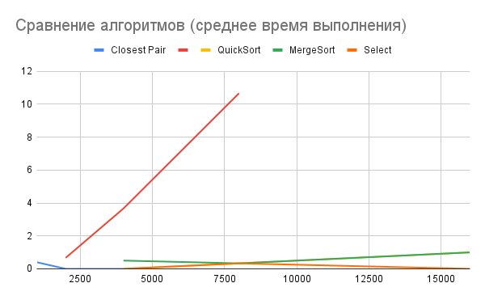

Assignment 1 – Design and Analysis of Algorithms
Group: SE2424
Student: Syndaly Yerzhan

OVERVIEW
This project implements four Divide-and-Conquer algorithms: MergeSort, QuickSort, Deterministic Select, and Closest Pair of Points.
The code is written in Java. JUnit is used for testing. During execution, metrics such as runtime, number of comparisons, and recursion depth are collected into metrics.csv and also written into separate CSV files for each algorithm. Charts are produced from these results to analyze performance.

IMPLEMENTATION
Main source files (src/main/java/algo):
MergeSort.java – merge sort, O(n log n)
QuickSort.java – quick sort, average O(n log n), worst O(n²)
DeterministicSelect.java – selection with median-of-medians, O(n)
ClosestPair.java – closest pair of points, O(n log n)
Metrics.java – counts comparisons, tracks recursion depth, measures time
SimpleCsv.java – appends results to CSV
Main.java – runs all algorithms and writes results
Test files (src/test/java/algo):
MergeSortTest.java
QuickSortTest.java
DeterministicSelectTest.java
ClosestPairTest.java
Build tool: Maven (pom.xml). JUnit 5 is used for unit testing.

EXPERIMENTAL RESULTS
Time vs Input Size

MergeSort and QuickSort both grow as n log n.
Select grows linearly with input size.
Closest Pair also grows as n log n.

Comparisons

MergeSort performs more comparisons than QuickSort.
Select shows about 2n comparisons, confirming linear growth.
Closest Pair comparisons remain close to zero in this implementation.

Recursion Depth

MergeSort recursion depth stays close to log₂(n).
QuickSort depth is higher but still logarithmic on average due to randomized pivot.
Select and Closest Pair recursion depth is negligible.

CONCLUSION
The experiments confirm theoretical complexity:
MergeSort and QuickSort both have Θ(n log n) runtime.
Deterministic Select has linear Θ(n) complexity.
Closest Pair of Points runs in Θ(n log n) and keeps recursion depth low.
The results match the theoretical recurrences within constant factors.

HOW TO RUN
Requirements: JDK 17+, Maven 3.x
Build the project:
mvn package
mvn exec:java -Dexec.mainClass="algo.Main"
mvn test
# DAA_asik1
